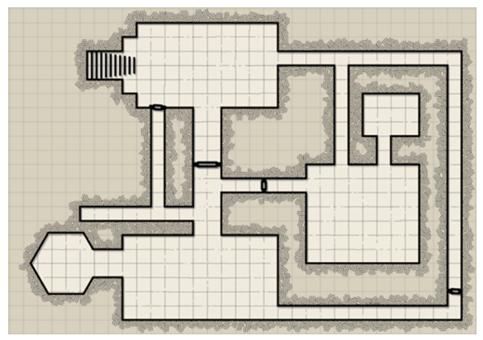
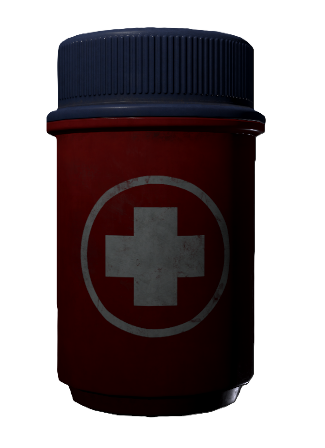
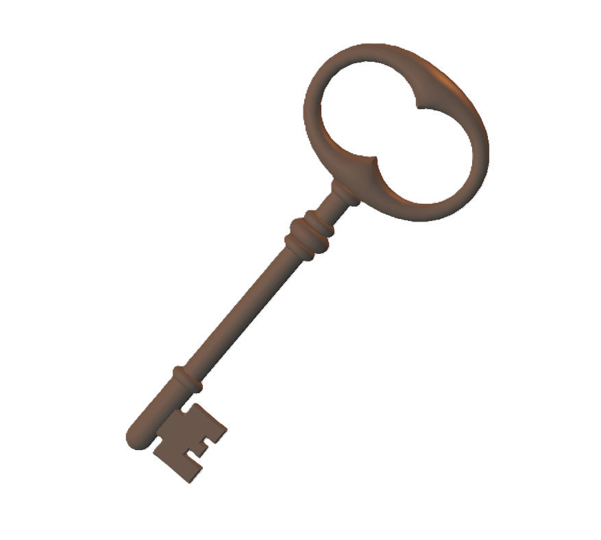
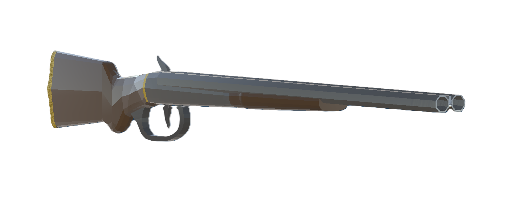

# 3D Dungeon Crawler

A thrilling 3D Dungeon Crawler survival game built with **Unity (2021.3.45f1)**. Navigate through an intricate map, fight off enemies, manage your inventory, and find the ultimate trophy to win!

## 📸 Screenshots

<p align="center">
  
  <br><em>Top-down view of the dungeon layout</em>
</p>

| Health Item | Key | Weapon |
|:---:|:---:|:---:|
|  |  |  |

## 🎬 Gameplay Videos

[](https://youtu.be/Uk4GoaA_SH8)
> 🎮 *Click the image above to watch Gameplay Demo 1*

[](https://youtu.be/bTUQZ0yNIxY)
> 🎮 *Click the image above to watch Gameplay Demo 2*

## 🎮 Gameplay Features

* **First-Person Action:** Equip a gun, manage your ammunition, and fire at enemies to survive.
* **Dynamic Enemy AI:** 
  * **Regular Enemies:** Static hazards that deal contact damage if you get too close.
  * **Patrol Enemies:** Intelligent enemies that patrol the grounds, detect the player, and chase you down within a certain range.
* **Inventory & Item Management:**
  * Collect various items such as **Health Boosts**, **Keys**, and **Power-Ups**.
  * Quick-select items using number keys corresponding to your inventory slots.
  * Strategic inventory limits: You cannot pick up new items if your inventory is full—use your current items to make space!
* **Power-Ups:** Gain a temporary speed boost (running instead of walking) for 10 seconds to outrun enemies or traverse the map quickly.
* **Level Design & Guidance:**
  * Visual cues and lighting are strategically placed to indirectly guide the player towards the objective.
  * Arrow markers on the map provide direct guidance to find the essential key.

## 🏆 Objective

Explore the dungeon to find the **Key**, then navigate towards the brightly lit areas to locate the **Trophy**. Use the key near the trophy to complete the game!

## 🛠️ Technologies Used

* **Game Engine:** Unity 3D (2021.3.45f1)
* **Language:** C#
* **3D Assets & Models:** Sourced from CGTrader, TurboSquid, and Unity Asset Store. (Models include Health Boosts, Keys, Guns, Enemies, and the Player Character).

## 🚀 How to Play

1. **Movement:** Standard FPS controls.
2. **Combat:** Click the mouse button to fire your weapon.
3. **Inventory:** Press the corresponding number key (e.g., `1`, `2`, `3`) to use the item in that inventory slot.
4. **Interaction:** Pick up items by walking over them (if you have inventory space). Use the key only when standing near the trophy.

## 📥 Installation & Setup

1. Clone the repository:
   ```bash
   git clone https://github.com/VirangMahendrabhaiMungra/3D-Dungeon-crawler.git
   ```
2. Open Unity Hub and click **Open**.
3. Select the cloned repository folder. Make sure you are using **Unity 2021.3.45f1** or a compatible version.
4. Open the main scene in the `Assets` folder and click the **Play** button to start the game!

---
*Developed as part of a game development coursework assignment.*
